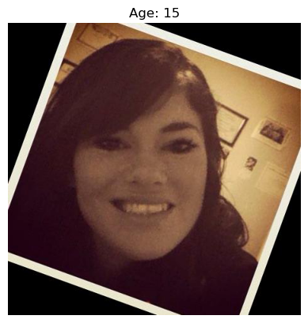
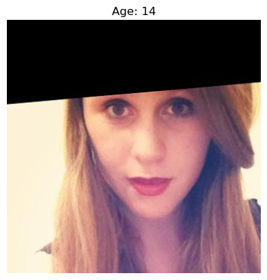
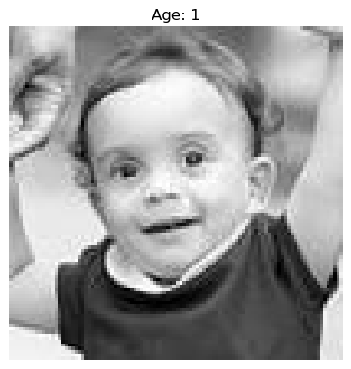
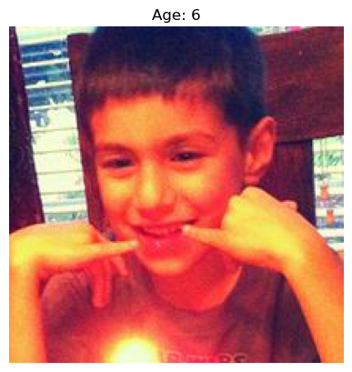
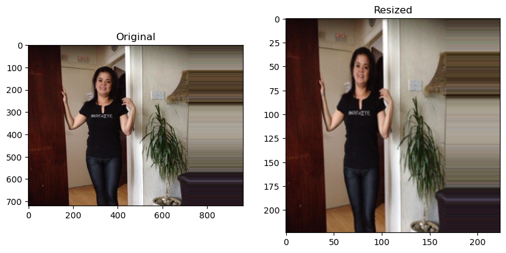
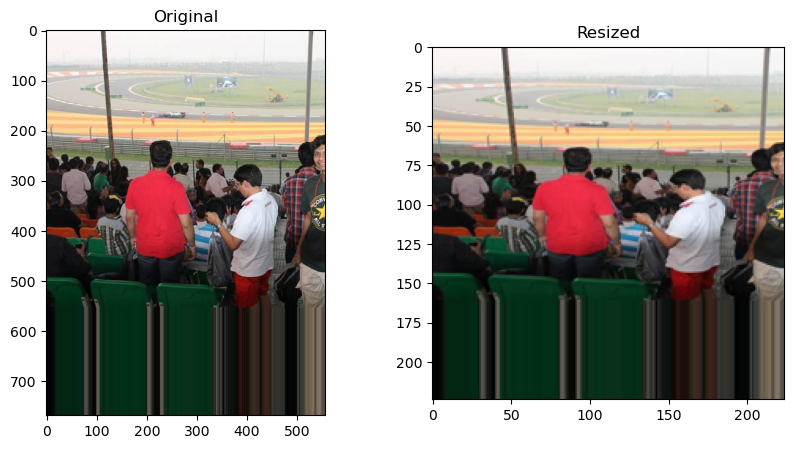

# Predicting Customer Age with Computer Vision

## Table of Contents

- [Notebook](/predict_age_com_vis.ipynb)
- [Project Overview](#project-overview)
- [EDA](#eda)
- [Model Training](#model-training)
- [Conclusions](#conclusions)
- [Approaches for Improvement](#approaches-for-improvement)

## Project Overview

The supermarket chain Good Seed is introducing a computer vision system for processing customer photos. Specifically, they are introducing cameras in the checkout area which are triggered when a customer is buying alcohol. The model will be used to predict the customer's age as part of the age verification process for legal alcohol purchases.

Our task is to build and evaluate a model that can verify a customer's age using customer facing camera at the register. The mean squared error will serve as our loss metric.

### Project Goals

- Analyze the dataset and provide feedback on the data quality
- Prepare the data and define functions for training
- Train the neural network to an MAE of no more than 8 years.
- Provide an assessment of the model and suggest further steps.

## EDA

### Age Distribution

  

There is good representation of ages between 14 and 40. This is acceptable since this is the age range where you would expect the most difficulty in determining age. There is also a large representation of ages from 0 to about 6 - this age group may be unnecessary to train on considering this age group isn't even capable of working the checkout machine. It would also probably be better to have closer to equal representation for ages between ~6 years old to ~80 years old.  

### Image Quality

Two functions were created to explore the photo dataset.

The `show_sample_images` was called as:

```python
age_ranges = [(0, 18), (18, 30), (30, 45), (45, 60), (60, 100)]

show_sample_images(age_ranges, samples_per_range=10)
```

One issue revealed through this sampling was the prevalence of oddly cropped images with surrounding black space. Here are two examples:

<div style="display: flex; justify-content: space-around;">

<!-- Next Image -->

</div>  
<br>

Another issue was images that were of particularly low resolution, or saturated with noise. Here is an example of each:
<div style="display: flex; justify-content: space-around;">

<!-- Next Image -->

</div>  
<br>
The sample output also raises some questions regarding diversity within the dataset. Of the 50 images shown, only about 3 or 4 looked to be non-white. This could be a problem if the model is not able to generalize to a more diverse population. To fix this, however, would require significant effort and time since images are not tagged by race or skin tone.  

<br>  

Further exploration of the photo dataset revealed three additional issues:

1. Some images are not square, thus will be distorted when resized to 224x224.
2. Some images are corrupted with odd artifacts running to the edges of the frame.
3. Some images are not suitable for our task (images that don't contain a face, or are very far away).

<div style="display: flex; justify-content: space-around;">

<!-- Next Image -->

</div>  
<br>
This brief exploration of the photo dataset revealed several issues that suggest this is not an ideal dataset for our purposes. For now we have been advised to proceed with the dataset as is. Suggestions for improvement have been made in the conclusions section.

## Model Training

Creating and training the model:

```python
def create_model(input_shape):

    """
    Defines the model
    """

    backbone = ResNet50(weights='imagenet',
                        input_shape=input_shape,
                        include_top=False)

    model = Sequential()
    model.add(backbone)
    model.add(GlobalAveragePooling2D())
    model.add(Dense(1, activation='relu'))

    optimizer = Adam(learning_rate=0.0005)
    model.compile(optimizer=optimizer, loss='mse', metrics=['mae'])

    return model

def train_model(model, train_data, test_data, epochs=20):
    """
    Trains a machine learning model using the provided training and testing data generators for a specified number of epochs.

    Parameters:
    model: The machine learning model to be trained.
    train_data: a tf.data.Dataset object containing the training data.
    test_data: a tf.data.Dataset object containing the testing data.
    epochs: (Optional) The number of epochs to train the model. Default is 20.
    
    Returns:
    model: The trained machine learning model.
    """
    import warnings

    # Ignore specific warning message
    warnings.filterwarnings('ignore', message='Your `PyDataset` class should call `super\(\).__init__\(\*\*kwargs\)` in its constructor.')

    model.fit(train_data,
              validation_data=test_data,
              epochs=epochs,
              verbose=2)

    return model

# Load the train and test data
train_data = load_train(path, im_dims=(224, 224))
test_data = load_test(path, im_dims=(224, 224))

# Create the model
model = create_model(train_data.image_shape)
# Train the model
model = train_model(model, train_data, test_data, epochs=20)
```

### Output

```
Epoch 1/20
178/178 - 159s - 894ms/step - loss: 201.0227 - mae: 10.5210 - val_loss: 299.6578 - val_mae: 12.8978
Epoch 2/20
178/178 - 61s - 344ms/step - loss: 102.7120 - mae: 7.7218 - val_loss: 372.4534 - val_mae: 14.3906
Epoch 3/20
178/178 - 82s - 462ms/step - loss: 66.2948 - mae: 6.2325 - val_loss: 365.2023 - val_mae: 14.2196
Epoch 4/20
178/178 - 62s - 348ms/step - loss: 47.8181 - mae: 5.2945 - val_loss: 193.2809 - val_mae: 10.1931
Epoch 5/20
178/178 - 62s - 348ms/step - loss: 32.6867 - mae: 4.3877 - val_loss: 107.7831 - val_mae: 8.1410
Epoch 6/20
178/178 - 61s - 341ms/step - loss: 24.2714 - mae: 3.7957 - val_loss: 91.7317 - val_mae: 7.2144
Epoch 7/20
178/178 - 62s - 348ms/step - loss: 19.2076 - mae: 3.3613 - val_loss: 79.7894 - val_mae: 6.7555
Epoch 8/20
178/178 - 82s - 463ms/step - loss: 17.9895 - mae: 3.2153 - val_loss: 94.3166 - val_mae: 7.1791
Epoch 9/20
178/178 - 62s - 348ms/step - loss: 16.2730 - mae: 3.1058 - val_loss: 85.3568 - val_mae: 6.7418
Epoch 10/20
178/178 - 61s - 344ms/step - loss: 17.1895 - mae: 3.1850 - val_loss: 84.4837 - val_mae: 6.8094
Epoch 11/20
178/178 - 83s - 465ms/step - loss: 15.7670 - mae: 3.0305 - val_loss: 84.5112 - val_mae: 6.9140
Epoch 12/20
178/178 - 82s - 459ms/step - loss: 13.4234 - mae: 2.8246 - val_loss: 83.7115 - val_mae: 7.0700
Epoch 13/20
178/178 - 62s - 349ms/step - loss: 12.7620 - mae: 2.7394 - val_loss: 106.1421 - val_mae: 7.7121
Epoch 14/20
178/178 - 83s - 464ms/step - loss: 10.7346 - mae: 2.5321 - val_loss: 87.8491 - val_mae: 7.4674
Epoch 15/20
178/178 - 62s - 347ms/step - loss: 9.8330 - mae: 2.4155 - val_loss: 73.6521 - val_mae: 6.4280
Epoch 16/20
178/178 - 92s - 519ms/step - loss: 8.9160 - mae: 2.2995 - val_loss: 73.8883 - val_mae: 6.4583
Epoch 17/20
178/178 - 72s - 402ms/step - loss: 8.4247 - mae: 2.1870 - val_loss: 77.7282 - val_mae: 6.7860
Epoch 18/20
178/178 - 61s - 345ms/step - loss: 7.8158 - mae: 2.1462 - val_loss: 74.7474 - val_mae: 6.4838
Epoch 19/20
178/178 - 82s - 463ms/step - loss: 8.0099 - mae: 2.1632 - val_loss: 112.7726 - val_mae: 8.3815
Epoch 20/20
178/178 - 63s - 351ms/step - loss: 9.4347 - mae: 2.3599 - val_loss: 88.0153 - val_mae: 7.3410
```

## Conclusions

The training results indicate that the model's performance improves significantly over the 20 epochs. Initially, the training loss (mean squared error) starts at 201.0227 with a mean absolute error (MAE) of 10.5210. By the final epoch, the training loss reduces to 9.4347, and the MAE decreases to 2.3599, indicating that the model is learning effectively. However, the validation loss and MAE do not show a consistent downward trend, starting from 299.6578 and 12.8978, respectively, and ending at 88.0153 and 7.3410. This suggests that while the model is improving on the training data, the performance on the validation set shows variability, indicating potential overfitting or data-related issues.

## Approaches for Improvement

- Augment or replace the photo dataset with another dataset of faces with age labels. Ideally one that is more diverse and has higher quality images.
- Additional cleaning of the photo dataset to address scaling / image corruption issues, images suitable to this task (is it really a photo capturing someone's face?), and diversity.
- Implement early stopping to monitor the validation loss and stop training when it no longer improves.  
- Add regularization techniques, such as dropout or L2 regularization, to prevent overfitting.
- Further increase the diversity of the training data through data augmentation techniques.
- Experiment with learning rate schedules or adaptive learning rates to optimize training.

## Libraries Used

Python 3.10.9  
pandas=2.0.3  
numpy=1.25.2  
matplotlib=3.7.1  
seaborn=0.13.1  
PIL=10.3.0  
tensorflow=2.17.0  
